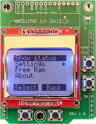

# Arduino User Interface:

This library is a simple user interface for building Arduino applications.  Text and menus are shown on an LCD display.  Four push buttons (Up, Down, Select & Back) make the interface very intuitive.

The *Arduino User Interface* library requires a *Nokia 5110 LCD* display.  The library works well with the *Arduino UI Shield*, which plugs directly on a Uno or Mega.  




The shield can also be assembled with header pins along the PCB's top for prototyping with the ArduinoNano.


Unfortunately this shield is not commercially available, so you will need to build your own.  PCB files and a schematic can be found at the GitHub link below.   You can also just wire up the display and buttons on a protoboard.  Find the hookup guide below.

 

Documentation for the *Arduino User Interface* library and *Arduino UI Shield* can be found at:
    https://github.com/Stan-Reifel/ArduinoUserInterface


##### Overview:

The user interface displays text and menus on a *Nokia 5110 LCD*  display.  The display is divided into two sections.  The top section is the *DisplaySpace*.  Here is where menus, message boxes, configuration screens, and the application's main displays are shown.

Displayed on the screen's bottom line is the *ButtonBar*.  Mounted just below the LCD are two push buttons.  The function of these buttons change, so the *ButtonBar* is used to label what the push buttons do.  Typically the left button will be labeled *Select* and the right one *Back*.

Two more buttons are used, one to go *Up* and the other to go *Down*.  These are mounted to the right side of the LCD.


##### Connecting the hardware:

The simplest way to build the user interface is with the *ArduinoUIShield* PCB.  The Nokia 5110 LCD displays are available from many suppliers (search for "Nokia 5110 LCD").  The display should be purchased already mounted on a carrier board, typically red.  Several version are sold with different pinouts. The *ArduinoUIShield* PCB requires the pin order from left to right be:

​                                         RST    CE    DC    DIN    CLK    VCC    LED    GND

The Nokia 5110 LCD boards sold at Spartkfun and Adafruit DO NOT have the correct pin order for the *ArduinoUIShield* PCB, but may be fine if you are wiring you own board.   I purchased my LCD on eBay, searching for "Nokia 5110 LCD".  Be sure to verify the pin order by looking at the vendor's pictures.

If you prefer to wire your own, here is a hookup guide:


**Important note:**  The contrast setting for each LCD display is different.  If the setting is too low, the screen will always be blank.  If too high, the screen will be black.  The contrast is set in software using the *lcdSetContrast()* function.  The easiest way to test your board is with the *Example1_SetContrast*  sketch found in the *examples* folder.  Run the sketch, press and hold the *Up* and *Down* buttons to find the optimal value, then press *Set* to set the contrast.


# Software Notes:

### Getting started:

The first step is to install the *ArduinoUserInterface* library on your computer.  Do so from the Arduino program by:  

1. Selecting:  *Sketch*  /  *Include Library*  /  *Manage Libraries...*
2. In the *Filter your search* field, type in:  *ArduinoUserInterface* 
3. Once found, click on *ArduinoUserInterface*, then click *Install*.


In your sketch, near the top, add this code:

```
#include <ArduinoUserInterface.h>
ArduinoUserInterface ui;
```


Inside your *void setup()* function, add this:

```
const byte LCD_CLOCK_PIN = A0;
const byte LCD_DATA_IN_PIN = A1;
const byte LCD_DATA_CONTROL_PIN = A2;
const byte LCD_RESET_PIN = 4;
const byte BUTTONS_ANALOG_PIN = A3;

ui.connectToPins(LCD_CLOCK_PIN, LCD_DATA_IN_PIN, LCD_DATA_CONTROL_PIN, 
                 LCD_RESET_PIN, BUTTONS_ANALOG_PIN);
ui.lcdSetContrast(80);		// your value will be different, between 0 & 127
```

The code above tells the library which Arduino pins are connected to the display.  These values assume you have an *Arduino UI Shield* and it's plugged into a *Uno* or *Mega*.  If you are using different IO pins, you will need to update the constants.  For example, with the *ArduinoNano*, the pins are:

```
const byte LCD_CLOCK_PIN = A0;
const byte LCD_DATA_IN_PIN = A1;
const byte LCD_DATA_CONTROL_PIN = A2;
const byte LCD_RESET_PIN = A3;
const byte BUTTONS_ANALOG_PIN = A6;
```


### Creating the main menu:

Just below the code for your *setup()* function you will define your *Main Menu*.  A typical main menu table might look like this:

```
//
// forward declarations for each menus
//
extern MENU_ITEM mainMenu[];
extern MENU_ITEM settingsMenu[];		// add this line if you have a "settingsMenu" sub menu

//
// the main menu table
//
MENU_ITEM mainMenu[] = {
  {MENU_ITEM_TYPE_MAIN_MENU_HEADER,  "",           NULL,                     mainMenu},
  {MENU_ITEM_TYPE_COMMAND,           "Log data",   menuCommandLogData,       NULL},
  {MENU_ITEM_TYPE_TOGGLE,            "Sound",      menuToggleSoundCallback,  NULL},
  {MENU_ITEM_TYPE_SUB_MENU,          "Settings",   NULL,                     settingsMenu},
  {MENU_ITEM_TYPE_END_OF_MENU,       "",           NULL,                     NULL}
};
```


Menu type:
The first line in a menu table sets what type the menu it is, either a *Main Menu*, or a *Sub Menu*.  Since we are building the main menu, the first column of this entry is set to: *MENU_ITEM_TYPE_MAIN_MENU_HEADER*.  Typically the fourth column is set to the main menu's name, i.e. *mainMenu*.


Commands:
A *MENU_ITEM_TYPE_COMMAND* entry indicates that a function (written by you) will be executed when this menu item is selected by the user. In the second column you place the text you want the user to see displayed in the menu for that command.  The third column is the name of the function that is executed when the menu item is clicked on.  The last column should always be *NULL*.


Toggles:
A *MENU_ITEM_TYPE_TOGGLE* is used somewhat like a Radio Button in a dialog box.  Toggles let the user choose one of a fixed number of choices (such as *On* / *Off*,  or  *Red* / *Green* / *Blue*).  Each time the user selects a toggle menu item, it alternates the selection.  In the second column is the text displayed in the menu.  The third column is the name of a callback function that you write to alternates the value. The last column should always be *NULL*.


Sub menus:
A *MENU_ITEM_TYPE_SUB_MENU* entry is used to select a different menu.  Often it is useful to group related commands into their own menu, this is what *Sub menus* are for. For example, the main menu might reference a *Settings* sub menu which would be filled with commands for configuring your app.  In the second column of this entry is the text displayed in the menu describing the sub menu.  The third column should always be *NULL*, and the last column is the name of the table defining the sub menu (i.e. *settingsMenu*).


Menu table end:
The table's last line marks the menu's end with a *MENU_ITEM_TYPE_END_OF_MENU* entry.  The second column should always be "".  The third and fourth columns are sent to *Null*.


### Creating a sub menu:

Sub-menus are menus called from the main menu, or another sub menu.  Sub menus allow you to group related commands into their own menu. For example, a *Settings* sub menu might be filled with commands for configuring your app.  Here is a typical sub menu:

```
//
// the Settings menu
//
MENU_ITEM settingsMenu[] = {
  {MENU_ITEM_TYPE_SUB_MENU_HEADER,    "",             NULL,                      mainMenu},
  {MENU_ITEM_TYPE_COMMAND,            "Set contrast", menuCommandSetContrast,    NULL},
  {MENU_ITEM_TYPE_TOGGLE,             "Power mode",   menuTogglePowerCallback,   NULL},
  {MENU_ITEM_TYPE_TOGGLE,             "LED",          menuToggleLEDCallback,     NULL},
  {MENU_ITEM_TYPE_END_OF_MENU,        "",             NULL,                      NULL}
};

```

Sub menus are built just like the Main menu, except that the first entry must be *MENU_ITEM_TYPE_SUB_MENU_HEADER*. In this entry's fourth column is the name of the parent menu (typically the main menu).  This is used to reselect the parent menu when the user presses the *Back* button, indicating they are done with the sub menu.


### The Toggle call back function:

Toggles let the user to select one of a fixed number of choices (such as *On* / *Off*,  or  *Red* / *Green* / *Blue*).  Each time the user clicks on a toggle menu item, it alternates the selection (i.e. toggles between *On* and *Off*, or rotates between *Red*, *Green* and *Blue*). To accomplish this, the Toggle's menu entry includes the name of a callback function that you must write.  This function does several things:  1) Switches to the next state.  2) Optionally updates hardware to reflect the new state.  3) Sets the text displayed in the menu for that state.  

Here's an example of how to write the callback function for a Toggle:

```
void menuToggleLEDCallback(void)
{
  //
  // check if menu is requesting the state be changed (can have more than 2 states)
  //
  if (ui.toggleMenuChangeStateFlag)
  {
    ledState = !ledState;					// select the next state
  }
  
  //
  // turn the LED on or off as indicated by the state
  //
  if (ledState)
    digitalWrite(LED_PIN, HIGH);
  else
    digitalWrite(LED_PIN, LOW);
 
  //
  // send back text describing the current state
  //
  if(ledState)
    ui.toggleMenuStateText = "On";
  else
    ui.toggleMenuStateText = "Off";
}
```


### Making the first screen show your application, not a menu:

Most of the examples sketches included with this library display the menu when the sketch first runs.  In some cases you want to start with your application showing its own display, then let the user press a button to pull up the menu.  An example sketch of this type is *Example8_StopWatch* found in the *examples* folder.  

In this situation you will display your application when the sketch first runs.  At the bottom of the LCD you will show the *Menu* button.  At any time the user can bring up the menu by clicking on it.  

Normally the Main Menu does not show a *Back* button, but here you want to enable it.  This will provide a way to return from the menu, back to your application.  To enable the *Back* button in your Main Menu, the fourth column in the *MENU_ITEM_TYPE_MAIN_MENU_HEADER* line is set to NULL (instead of *mainMenu*, which is typical).


### Set a number using the *Slider*:

Frequently Arduino applications need the user to enter a number.  For this purpose, the library makes use of *Sliders*.  A Slider allows the users to select a numeric value (such as 0 to 255, or -1000 to 1000,  or  0.0 to 15.5).  There are two types of slides, one for INTs and one for FLOATs.

Sliders look like this:


To add a Slider to your sketch, you first create a function that is called from your menu as a Command.  A Command function to display a Slider might look something like this:

```
void menuCommandSetContrast(void)
{
  int minValue = 1;
  int maxValue = 127;
  int step = 1;						// add/subtract this value with each click of up/down
  int initialValue = 59;     		 // set the starting value
  
  ui.displaySlider(minValue, maxValue, step, initialValue, "Set Contrast", setContrastCallback);
}
```


In the call to *ui.displaySlider()* above, the last argument (i.e. *setContrastCallback*) is a function that you must write.  This callback function is executed when the user presses any of the buttons while the slider is displayed.  Here is an example:

```
void setContrastCallback(byte operation, int value)
{
  switch(operation)
  {
    case SLIDER_DISPLAY_VALUE_CHANGED:
    {
      //
      // This is executed when the user clicks Up & Down.  You can just have  
      // the "break;" statement, but if you want to update hardware as the user 
      // changes the value, you add that code here.
      //
      ui.lcdSetContrast(value);
      break;					// always be sure to include this line
    }
    
    case SLIDER_DISPLAY_VALUE_SET:
    {
      //
      // This is executed when the user presses "Set". Here you will want to save the
      // value selected by the user.
      //
      contrastSetting = Value;
      saveContrastConfigValue(value);
      break;					// always be sure to include this line
    }
    
    case SLIDER_DISPLAY_CANCELED:
    {
      //
      // This is executed when the user clicks "Cancel".  This can just have the  
      // "break;" statement, but if you want to update hardware to restore the
      // originial value, do it here.
      //
      ui.lcdSetContrast(getContrastConfigValue());
      break;					// always be sure to include this line
    }
  }
}
```


The above example lets the user to choose a number that is an *int*, a value between −32,768 and 32,767.  The example below shows how to use a Slider get a number that is a *float*.

```
void menuCommandSetFakeMultiplier(void)
{
  float minValue = 0.0;				// setup values and displa the slider
  float maxValue = 1.0;
  float step = 0.05;
  float initialValue = stateFakeMultiplier;
  byte showDigitsRightOfDecimal = 2;

  ui.displayFloatSlider(minValue, maxValue, step, initialValue, "Multiplier", 
     showDigitsRightOfDecimal, setMultiplierCallback);
}


void setMultiplierCallback(byte operation, float value)
{
  switch(operation)
  {
    case SLIDER_DISPLAY_VALUE_CHANGED:
    {
      break;					  // always be sure to include this line
    }
    
    case SLIDER_DISPLAY_VALUE_SET:
    { 
      stateFakeMultiplier = value;	// save the value chosen by the user
      break;					  // always be sure to include this line
    }
    
    case SLIDER_DISPLAY_CANCELED:
    {
      break;					  // always be sure to include this line
    }
  }
}
```


### Saving configuration settings:

Toggles and Slider are often used to configure your project at runtime.  These setting values can be saved in the Arduino's EEPROM so the project defaults to the configured values when powered up.

The *Arduino User Interface* library has these functions for saving/reading configuration values:
      writeConfigurationByte()     and     readConfigurationByte()
      writeConfigurationInt()        and     readConfigurationInt()
      writeConfigurationLong()    and     readConfigurationLong()


Below is example code for writing and reading two different configuration settings, a  *int* representing the contrast setting, and a *byte* indicating if an LED should be On or Off.

```
//
// indexes into the EEPROM for configuation data, NOTE: saving a byte uses 2 
// bytes of EEPROM, saving an int uses 3 bytes, a long uses 5 bytes
//
const int EEPROM_CONTRAST_IDX = 0;
const int EEPROM_LED_IDX = EEPROM_CONTRAST_BYTE_IDX + 3;
const int EEPROM_NEXT_FREE_IDX = EEPROM_LED_IDX + 2;


//
// get/set contrast configuration value
//
const int CONFIG_CONTRAST_DEFAULT = 65;

void saveContrastConfigValue(int value) 
{
  ui.writeConfigurationInt(EEPROM_CONTRAST_IDX, value);
}

byte getContrastConfigValue(void) 
{
  int value = ui.readConfigurationInt(EEPROM_CONTRAST_IDX, CONFIG_CONTRAST_DEFAULT);    
  return(value);
}


//
// get/set LED configuration value
//
const byte CONFIG_LED_DEFAULT = false;

void saveLEDConfigValue(byte value) 
{
  ui.writeConfigurationByte(EEPROM_LED_IDX, value);
}

byte getLEDConfigValue(void) 
{
  byte value = ui.readConfigurationByte(EEPROM_LED_IDX, CONFIG_LED_DEFAULT);    
  return(value);
}

```

Note 1:  The functions that read a configuration value take a *Default value*.  This value is returned if no value has ever been saved for that configuration setting (i.e.  The first time the app is runs, the user will have never set any configuration setting).

Note 2: You need to manage where in EEPROM each of your values is saved.  Your first value

Note 3: When determining the index positions in the EEPROM for each configuration value,  it is important to note that they take one more byte than the data type requires (i.e. 3 EEPROM bytes are needed for an *int*, 5 for a *long*).  See how this is done in the *const* declarations above.


### Displaying text:

The library includes many functions for drawing your own displays.  Examples might be Commands called from your menu that print information.  The general approach to creating your own displays is:

1. Clear the screen by calling *clearDisplaySpace()* or *lcdClearDisplay()*.

2. Set the cursor position with *lcdSetCursorXY(X, Y)*.  Note, X is the pixel column (0 to 83).  Y is the line number (0 to 5).  0 being the top line of text, and 5 being the bottom line of text.

3. Print some text.  There are many functions for printing.  A few included:
       lcdPrintString(s)
       lcdPrintStringCentered(s)
       lcdPrintStringRightJustified(s, n)
       lcdPrintInt(n)
   See below for documentation on all printing functions.

   Note: The functions that print strings, expect a *C String*, meaning an array of *char* terminated by a 0 (as opposed to a string created using a *String Object*).

4. You may want to draw the *Button Bar* at the bottom of your display, then wait for the user to click the *OK* button.  Here is an example of that:

   ```
    ui.drawButtonBar("OK", "");
    while(ui.getButtonEvent() != BUTTON_ID_SELECT + BUTTON_PUSHED_EVENT)
       ;
   ```


# The Library of Functions:  

### Setup functions: 

```
//
// connect the IO pins for the LCD and buttons, then clear the display
//  Enter:  _lcdClockPin = digital pin that connects to the LCD's clock pin (CLK)
//          _lcdDataInPin = digital pin that connects to the LCD's data pin (DIN)
//          _lcdDataControlPin = digital pin that connects to LCD's control pin (DC)
//          _lcdChipEnablePin = digital pin that connects to the LCD's chip enable pin (CE)
//          _buttonAnalogPin = analog pin that connects to the buttons
//
void ArduinoUserInterface::connectToPins(byte _lcdClockPin, byte _lcdDataInPin, 
                              byte _lcdDataControlPin, byte _lcdChipEnablePin,
                              byte _buttonAnalogPin)
```


### Menu functions: 

```
//
// display the top leven menu, wait for button presses and execute commands 
// connected to the menu
//  Enter:  menu -> the menu to display
//
void ArduinoUserInterface::displayAndExecuteMenu(MENU_ITEM *menu)
```


### Slider functions:

```
//
// Slider Display callback actions
//
const byte SLIDER_DISPLAY_VALUE_CHANGED = 1;
const byte SLIDER_DISPLAY_VALUE_SET     = 2;
const byte SLIDER_DISPLAY_CANCELED      = 3;


//
// the Slider Display
//	Enter:  minValue = the minimum value for the slider
//		      maxValue = the max value for the slider
//		      step = amount added/subtracted to the value with each button press
//		      initialValue = initial value to display on the slider
//		      label -> string printed above the slider
//		      callbackFunc -> the callback function, see "Set a number using the Slider"
//			    above for information on writing the callback function
//
void ArduinoUserInterface::displaySlider(int minValue, int maxValue, int step, 
                int initialValue, char *label, void (*callbackFunc)(byte, int))


//
// the Float Slider Display
//  Enter:  minValue = the minimum value for the slider
//	        maxValue = the max value for the slider
//	        step = amount added/subtracted to the value with each button press
//	        initialValue = initial value to display on the slider
//	        label -> string printed above the slider
//          digitsRightOfDecimal = number of digits right of the decimal point 
//            that are displayed
//	        callbackFunc -> the callback function, see "Set a number using the Slider"
//			 above for information on writing the callback function
//
void ArduinoUserInterface::displayFloatSlider(float minValue, float maxValue, 
            float step, float initialValue, char *label, byte digitsRightOfDecimal, 
            void (*callbackFunc)(byte, float))

```


### Button functions:

```
//
// ID values for the buttons, these constants are defined in ArduinoUserInterface.h
//
const byte BUTTON_ID_NONE        = 0;
const byte BUTTON_ID_SELECT      = 1;	// the button below the LCD on the left
const byte BUTTON_ID_BACK        = 2;	// the button below the LCD on the right
const byte BUTTON_ID_UP          = 3;	// the button right of the LCD on the top
const byte BUTTON_ID_DOWN        = 4;	// the button right of the LCD on the bottom


//
// types of button events
//
const byte BUTTON_NO_EVENT        = 0x00;	// the button has not changed
const byte BUTTON_PUSHED_EVENT    = 0x40;	// the button was pressed down
const byte BUTTON_RELEASED_EVENT  = 0x80;	// the button was released
const byte BUTTON_REPEAT_EVENT    = 0xc0;	// the button is held down & periodically repeats


//
// check for an event from any of the push buttons, this function will return without blocking
//   Exit:  event value returned (sum of the button ID + the button event, see above constants)
//           BUTTON_NO_EVENT returned if no event
//
byte ArduinoUserInterface::getButtonEvent(void)


//
// draw the button bar
//  Enter:  leftButtonText -> text for left button, empty string will draw no button
//          rightButtonText -> text for right button, empty string will draw no button
//
void ArduinoUserInterface::drawButtonBar(char *leftButtonText, char *rightButtonText)
```


### Display space functions:

```
//
// clear the LCD "display space" the LCD's first 5 lines, but not include the button bar
//
void ArduinoUserInterface::clearDisplaySpace(void)

```


### LCD drawing functions:

```
//
// print a signed int at location of the cursor
//  Enter:  n = signed number to print 
//
void ArduinoUserInterface::lcdPrintInt(int n)


//
// print a signed int at location of the cursor, left justified, optional white 
// space will be added after the digits to pad to the given width
//  Enter:  n = signed number to print 
//          padToNumberOfDigits = total width of the number (in characters)  
//            including white space after the digits (0 to 6)
//
void ArduinoUserInterface::lcdPrintIntLeftJustified(int n, int padToNumberOfDigits)


//
// print a signed int at location of the cursor, right justified, optional white 
// space will be added before the digits to pad to the given width
//  Enter:  n = signed number to print 
//          padToNumberOfDigits = total width of the number (in characters)  
//            including white space after the digits (0 to 6)
//
void ArduinoUserInterface::lcdPrintIntRightJustified(int n, int padToNumberOfDigits)


//
// print a signed int at location of the cursor, center, optional white 
// space will be added before and after the digits to pad to the given width
//  Enter:  n = signed number to print 
//          padToNumberOfDigits = total width of the number (in characters)  
//            including white space after the digits (0 to 6)
//
void ArduinoUserInterface::lcdPrintIntCentered(int n, int padToNumberOfDigits)


//
// print a string to the LCD display
//  Enter:  s -> a null terminated string 
//
void ArduinoUserInterface::lcdPrintString(char *s)


//
// print a string at location of the cursor, left justified, optional white 
// space will be added after the string to pad to the given character width
//  Enter:  s -> string to print 
//          padToNumberOfCharacters = total width of printed string (in characters)  
//            including white space after the string (0 to 13)
//
void ArduinoUserInterface::lcdPrintStringLeftJustified(char *s, 
                            int padToNumberOfCharacters)


//
// print a string at location of the cursor, right justified, optional white 
// space will be added before the string to pad to the given width
//  Enter:  s -> string to print 
//          padToNumberOfCharacters = total width of printed string (in characters)  
//            including white space after the string (0 to 13)
//
void ArduinoUserInterface::lcdPrintStringRightJustified(char *s, 
                              int padToNumberOfCharacters)

//
// print a string at location of the cursor, center, optional white 
// space will be added before and after the string to pad to the given width
//  Enter:  s -> string to print 
//          padToNumberOfCharacters = total width of printed string (in   
//            characters) including white space after the string (0 to 13)
//
void ArduinoUserInterface::lcdPrintStringCentered(char *s, int padToNumberOfCharacters)


//
// print a string in reverse video to the LCD with centering on the current line
//  Enter:  s -> a null terminated string 
//          X = X coord to the center position to print (0 - 83)
//          padToWidth = desired with of reverse video string, black padding will
//            be added on each side of the string if needed, set to zero to add no 
//            padding
//
void ArduinoUserInterface::lcdPrintCenteredStringReverse(char *s, byte X, 
                               byte padToWidth)

//
// print a string to the LCD display in reverse video
//  Enter:  s -> a null terminated string 
//
void ArduinoUserInterface::lcdPrintStringReverse(char *s)


//
// print one ASCII charater to the display
//  Enter:  c = character to display
//
void ArduinoUserInterface::lcdPrintCharacter(byte character)


//
// print one ASCII charater to the display in reverse video
//  Enter:  c = character to display
//
void ArduinoUserInterface::lcdPrintCharacterReverse(byte character)


//
// determine the width of a string in pixels
//
byte ArduinoUserInterface::lcdStringWidthInPixels(char *s)


//
// clear the LCD display by writing blank pixels
//
void ArduinoUserInterface::lcdClearDisplay(void)


//
// fill current line, beginning at the cursor location with a repeating column 
// of 8 pixels up to the X column
//          X = fill up to, but not including this column, the cursor will 
//              then be at this column
//          byteOfPixels = byte of pixels to repeat
//
void ArduinoUserInterface::lcdFillToColumnX(int X, byte byteOfPixels)


//
// fill current line, beginning at the cursor location to the end of the line, 
// with a repeating column of 8 pixels
//          byteOfPixels = byte of pixels to repeat
//
void ArduinoUserInterface::lcdFillToEndOfLine(byte byteOfPixels)


//
// draw a row of pixels, repeating the same column of 8 pixels across
//  Enter:  X1 = starting pixel column (0 - 83, 0 = left most column)
//          X2 = ending pixel column (0 - 83)
//          lineNumber = character line (0 - 5, 0 = top row)
//          byteOfPixels = byte of pixels to repeat
//
void ArduinoUserInterface::lcdDrawRowOfPixels(int X1, int X2, int lineNumber, 
                                              byte byteOfPixels)

//
// set the coords where the next character will be written to the LCD display
//  Enter:  column = pixel column (0 - 83, 0 = left most column)
//          lineNumber = character line (0 - 5, 0 = top row)
//
void ArduinoUserInterface::lcdSetCursorXY(int column, int lineNumber)


//
// set the LCD screen contrast value 
//  Enter:  contrastValue = value to set for the screen's contrast (0 - 127)
//
void ArduinoUserInterface::lcdSetContrast(int contrastValue)
```


### Reading/writing configuration values:

```
//
// write a configuration byte to the EEPROM
//  Enter:  EEPromAddress = address in EEPROM to write 
//          value = 8 bit value to write to EEPROM
//          note: 2 bytes of EEPROM space are used 
//
void ArduinoUserInterface::writeConfigurationByte(int EEPromAddress, byte value)


//
// read a configuration byte from the EEPROM
//  Enter:  EEPromAddress = address in EEPROM to read from 
//          defaultValue = default value to return if value has never been 
//            written to the EEPROM
//          note: 2 bytes of EEPROM space are used 
//  Exit:   byte value from EEPROM (or default value) returned
//
byte ArduinoUserInterface::readConfigurationByte(int EEPromAddress, byte defaultValue)


//
// write a configuration int to the EEPROM
//  Enter:  EEPromAddress = address in EEPROM to write 
//          value = 16 bit value to write to EEPROM
//          note: 3 bytes of EEPROM space are used 
//
void ArduinoUserInterface::writeConfigurationInt(int EEPromAddress, int value)


//
// read a configuration int from the EEPROM
//  Enter:  EEPromAddress = address in EEPROM to read from 
//          defaultValue = default value to return if value has never been 
//            written to the EEPROM
//          note: 3 bytes of EEPROM space are used 
//  Exit:   int value from EEPROM (or default value) returned
//
int ArduinoUserInterface::readConfigurationInt(int EEPromAddress, int defaultValue)


//
// write a configuration long to the EEPROM
//  Enter:  EEPromAddress = address in EEPROM to write 
//          value = 16 bit value to write to EEPROM
//          note: 5 bytes of EEPROM space are used 
//
void ArduinoUserInterface::writeConfigurationLong(int EEPromAddress, long value)


//
// read a configuration long from the EEPROM
//  Enter:  EEPromAddress = address in EEPROM to read from 
//          defaultValue = default value to return if value has never been 
//            written to the EEPROM
//          note: 5 bytes of EEPROM space are used 
//  Exit:   long value from EEPROM (or default value) returned
//
long ArduinoUserInterface::readConfigurationLong(int EEPromAddress, long defaultValue)
```

Copyright (c) 2018 S. Reifel & Co.  -   Licensed under the MIT license.

