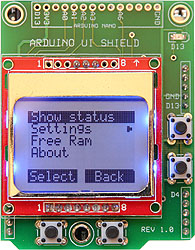

# Arduino User Interface

This library is a simple user interface for building Arduino applications.  Adding menus to your sketch is as-easy-as filling in a table.  The library requires a Nokia 5110 LCD display and four push buttons (Up, Down, Select & Back).  The library also includes many functions for displaying your own data.

## Documentation:
Documentation for the *Arduino User Interface* library and *Arduino UI Shield* can be found at:

​    https://github.com/Stan-Reifel/ArduinoUserInterface

## License:

Copyright (c) 2018 S. Reifel & Co.   -   Licensed under the MIT license.
